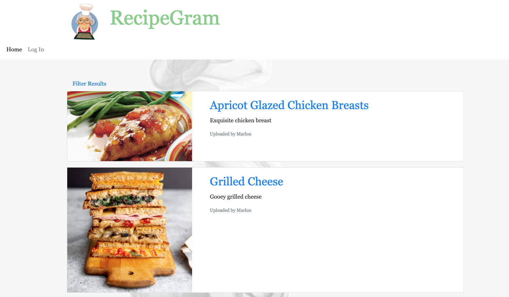

# Week 16 - Updated Portfolio
This repository is an updated version of my portfolio that I started on Week 2.

## Changes
* This new portfolio now uses Bootstrap to help handle browser compatibility, styling and mobile support.
* Added fontawesome CSS for icon support.
* Replaced placeholder projects/images with actual project links and screenshots.

## Screenshot

## Links
* Repository: https://github.com/drewml08/Portfolio
* Website: https://drewml08.github.io/Portfolio
